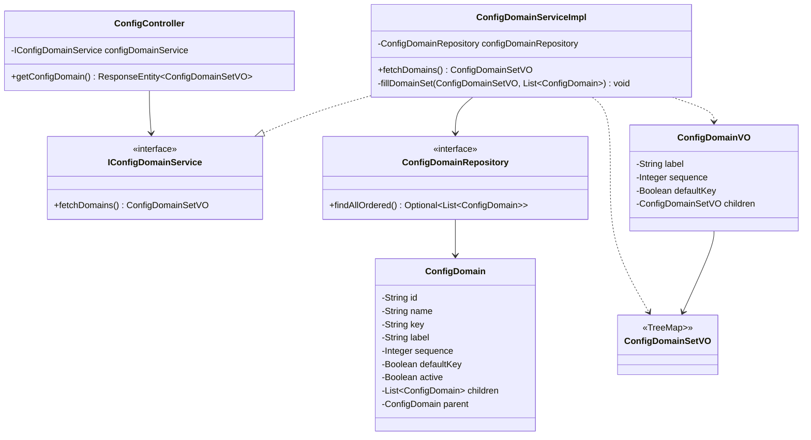

# abstract-nnp-common: Development & Contribution Guidelines

Welcome to the developer and maintainer guide for `abstract-nnp-common` (part of the **Platform Infrastructure and Core Components - PICC** area of the **Nubo Native Platform - NNP**).

This document outlines architecture specifications, local environment setup, coding conventions, testing requirements, extension patterns, and the release lifecycle.

---

## Table of Contents

1. [Architecture & Codebase Organization](#1-architecture--codebase-organization)
2. [Local Development Environment Setup](#2-local-development-environment-setup)
3. [Coding Standards & Conventions](#3-coding-standards--conventions)
4. [Extending & Adding Features](#4-extending--adding-features)
   - [4.1 Adding New Error Codes](#41-adding-new-error-codes)
   - [4.2 Enhancing the Domain Value Feature](#42-enhancing-the-domain-value-feature)
   - [4.3 Adding Utility Methods](#43-adding-utility-methods)
5. [Testing Strategy & Requirements](#5-testing-strategy--requirements)
6. [Build, Packaging & Maven Lifecycle](#6-build-packaging--maven-lifecycle)
7. [Branching, PR Workflow & Release Management](#7-branching-pr-workflow--release-management)
8. [Security & Compliance Guidelines](#8-security--compliance-guidelines)

---

## 1. Architecture & Codebase Organization

The project follows standard Maven multi-layer modularity within a single reusable library JAR:

```
src/
├── main/
│   ├── java/com/nnp/common/abs/
│   │   ├── constant/
│   │   │   └── NNPCommonConstants.java           # Global constants (ID prefixes, delimiters)
│   │   ├── exception/
│   │   │   ├── NNPErrorCodes.java                # Standard error enumeration & status codes
│   │   │   └── NNPException.java                 # Base runtime exception
│   │   ├── features/
│   │   │   └── domainvalues/                     # Dynamic domain configuration feature
│   │   │       ├── controller/
│   │   │       │   └── ConfigController.java     # REST endpoint (/config/domain)
│   │   │       ├── entity/
│   │   │       │   └── ConfigDomain.java         # JPA entity mapping common.cfg_domain
│   │   │       ├── repo/
│   │   │       │   └── ConfigDomainRepository.java # Spring Data JPA repository
│   │   │       ├── service/
│   │   │       │   ├── IConfigDomainService.java # Service interface
│   │   │       │   └── ConfigDomainServiceImpl.java # Hierarchical tree builder
│   │   │       └── vo/
│   │   │           ├── ConfigDomainVO.java       # Value Object for domain nodes
│   │   │           └── ConfigDomainSetVO.java    # Nested TreeMap response wrapper
│   │   └── util/
│   │       ├── NNPUtil.java                      # BeanUtils reflection & string utilities
│   │       └── UUIDGenerator.java                # Atomic time-ordered identifier generator
│   └── resources/
│       ├── application.yml.example               # Reference consumer configuration
│       └── dbscripts/
│           ├── V1__DDL_config_domain.sql         # Schema & DDL definition
│           └── V2__DML_config_domain_sample_data.sql # Seed master data
└── test/
    └── java/com/nnp/common/abs/                  # Unit and integration test suites
```

### Class Relationship Diagram:



---

## 2. Local Development Environment Setup

### 2.1 Prerequisites
- **JDK 17 or JDK 21** installed and configured in your `JAVA_HOME` environment variable.
- **Apache Maven 3.8+** installed.
- **Docker / Docker Desktop** (for local PostgreSQL database testing).
- **IDE**: IntelliJ IDEA (recommended), Eclipse, or VS Code with Java Extension Pack.

### 2.2 IDE Configuration for Project Lombok
`abstract-nnp-common` leverages Project Lombok (`@Getter`, `@Setter`, `@Data`, `@Slf4j`, `@AllArgsConstructor`).

- **IntelliJ IDEA**:
  1. Install the **Lombok Plugin** (bundled by default in modern IDEA).
  2. Navigate to `Settings` &rarr; `Build, Execution, Deployment` &rarr; `Compiler` &rarr; `Annotation Processors`.
  3. Check **Enable annotation processing**.
- **VS Code**:
  - Install the extension `Lombok Annotations Support for VS Code`.
- **Eclipse**:
  - Download `lombok.jar` and run `java -jar lombok.jar` to install into your Eclipse installation.

### 2.3 Starting Local PostgreSQL (Optional for Local DB Testing)
```bash
docker run -d --name nnp-postgres-dev \
  -e POSTGRES_DB=nnp_db \
  -e POSTGRES_USER=postgres \
  -e POSTGRES_PASSWORD=postgres \
  -p 5432:5432 \
  postgres:15-alpine
```

Execute the initialization scripts:
```bash
# Execute DDL
psql -h localhost -U postgres -d nnp_db -f src/main/resources/dbscripts/V1__DDL_config_domain.sql

# Execute Sample Master Data
psql -h localhost -U postgres -d nnp_db -f src/main/resources/dbscripts/V2__DML_config_domain_sample_data.sql
```

---

## 3. Coding Standards & Conventions

1. **Java Version**: Always target Java 17 features. Avoid features exclusive to Java 21+ unless guarded or configured via POM profiles.
2. **Immutability & Safety**:
   - Helper utility classes (`NNPUtil`, `UUIDGenerator`) must maintain thread-safe static state (e.g. `AtomicInteger`).
   - Constant classes must declare `public static final` constants.
3. **Lombok Usage**:
   - Use `@Getter` and `@Setter` at class or field level.
   - For JPA entities, avoid `@ToString` or `@EqualsAndHashCode` on circular relationship fields (e.g. `parent`/`children`) to prevent infinite recursion and stack overflows.
4. **Logging**:
   - Use `@Slf4j` for logging.
   - Use parameterized placeholders (`log.debug("Processing item: {}", id)`) rather than string concatenation.
   - Do not log sensitive credentials, passwords, or PII.
5. **Exception Handling**:
   - Throw `NNPException` with appropriate `NNPErrorCodes` instead of generic `RuntimeException` or `NullPointerException`.
   - Always provide contextual debug messages.

---

## 4. Extending & Adding Features

### 4.1 Adding New Error Codes
When adding new business error conditions, append to [NNPErrorCodes.java](file:///d:/GITHUB%20Migration/GITHUB/PICC-PC-Abstract-NNP-Common/src/main/java/com/nnp/common/abs/exception/NNPErrorCodes.java):

```java
public enum NNPErrorCodes {
    BAD_REQ_PARAM(400, "Bad request parameter"),
    ITEM_NOT_FOUND(404, "Item Not Found"),
    UNAUTHORIZED_ACCESS(401, "Unauthorized access"), // New error code
    RATE_LIMIT_EXCEEDED(429, "Rate limit exceeded"), // New error code
    ...
```

### 4.2 Enhancing the Domain Value Feature
To add filtered domain lookups (e.g., fetch by specific domain name):

1. **Update Repository** (`ConfigDomainRepository.java`):
   ```java
   @Query("select c from ConfigDomain c where c.name = :domainName and c.active = true order by c.sequence, c.label, c.key")
   Optional<List<ConfigDomain>> findByNameOrdered(@Param("domainName") String domainName);
   ```

2. **Update Service Interface & Implementation** (`IConfigDomainService.java` & `ConfigDomainServiceImpl.java`):
   ```java
   public ConfigDomainSetVO fetchDomainByName(String domainName);
   ```

3. **Expose Endpoint** (`ConfigController.java`):
   ```java
   @GetMapping(value = "/domain/{name}", produces = MediaType.APPLICATION_JSON_VALUE)
   public ResponseEntity<ConfigDomainSetVO> getDomainByName(@PathVariable String name) {
       return ResponseEntity.ok(configDomainService.fetchDomainByName(name));
   }
   ```

### 4.3 Adding Utility Methods
When adding reflection, conversion, or string helpers to `NNPUtil`:
- Add unit tests verifying `null`, empty string, whitespace, and typical positive cases.
- Avoid introducing heavy third-party dependencies into `pom.xml` if standard JDK / Spring Core APIs suffice.

---

## 5. Testing Strategy & Requirements

All PRs must maintain or improve test coverage.

### 5.1 Unit Tests (JUnit 5 + Mockito)
Unit tests should be placed in `src/test/java/com/nnp/common/abs/`.

Example test for `UUIDGenerator`:
```java
package com.nnp.common.abs.util;

import org.junit.jupiter.api.Test;
import static org.junit.jupiter.api.Assertions.*;

class UUIDGeneratorTest {

    @Test
    void testGenerateIdWithCustomPrefix() {
        UUIDGenerator.setAppPrefix("TEST");
        String id = UUIDGenerator.generateId("USR");
        
        assertNotNull(id);
        assertTrue(id.startsWith("TEST-USR-"));
    }
}
```

Example test for `NNPUtil`:
```java
package com.nnp.common.abs.util;

import org.junit.jupiter.api.Test;
import static org.junit.jupiter.api.Assertions.*;

class NNPUtilTest {

    @Test
    void testIsBlankOrNull() {
        assertTrue(NNPUtil.isBlankOrNull(null));
        assertTrue(NNPUtil.isBlankOrNull(""));
        assertTrue(NNPUtil.isBlankOrNull("   "));
        assertFalse(NNPUtil.isBlankOrNull("valid"));
    }
}
```

### 5.2 Running the Test Suite
```bash
# Run all tests
mvn clean test

# Run a specific test class
mvn test -Dtest=UUIDGeneratorTest
```

---

## 6. Build, Packaging & Maven Lifecycle

### 6.1 Standard Build Commands
```bash
# Compile and package without running tests
mvn clean package -DskipTests

# Complete build with test execution, source attachment, and javadoc generation
mvn clean verify
```

### 6.2 Generating Source & Javadoc Artifacts
The POM is preconfigured with `maven-source-plugin` and `maven-javadoc-plugin`:
```bash
mvn source:jar javadoc:jar
```
Generated artifacts:
- `target/abstract-nnp-common-1.0.0.jar`
- `target/abstract-nnp-common-1.0.0-sources.jar`
- `target/abstract-nnp-common-1.0.0-javadoc.jar`

### 6.3 Local Installation
To install into your local `~/.m2/repository` for testing in other local microservices:
```bash
mvn clean install
```

---

## 7. Branching, PR Workflow & Release Management

### 7.1 Branching Strategy
- `main`: Stable, releasable codebase. Direct commits are restricted.
- `develop`: Integration branch for upcoming releases.
- `feature/<feature-name>`: Dedicated feature development branches.
- `fix/<issue-key>`: Bugfix branches.

### 7.2 Pull Request Checklist
Before submitting a PR:
- [ ] Code compiles cleanly with no compiler warnings (`mvn clean compile`).
- [ ] All unit tests pass (`mvn test`).
- [ ] Code follows formatting standards (standard 4-space indentation, no unused imports).
- [ ] No secrets, credentials, or `.env` files are included in the commit history.
- [ ] If changing database schema, both DDL and DML scripts in `src/main/resources/dbscripts/` are updated.
- [ ] Javadoc comments are provided for public APIs and utility methods.

### 7.3 Publishing to Central / Sonatype OSSRH
The `pom.xml` contains deployment configurations for Sonatype OSSRH:

```bash
# Staging deployment (requires GPG signing and OSSRH credentials in settings.xml)
mvn clean deploy -P release
```

---

## 8. Security & Compliance Guidelines

- **No Hardcoded Secrets**: Under no circumstances should API keys, passwords, database credentials, or certificates be committed.
- **Dependency Vulnerability Audits**: Run `mvn dependency-check:check` periodically to identify known CVEs in upstream dependencies.
- **Security Inquiries**: For security vulnerability reporting, follow instructions in [SECURITY.md](SECURITY.md) by contacting `contribution@nubons.com`.
