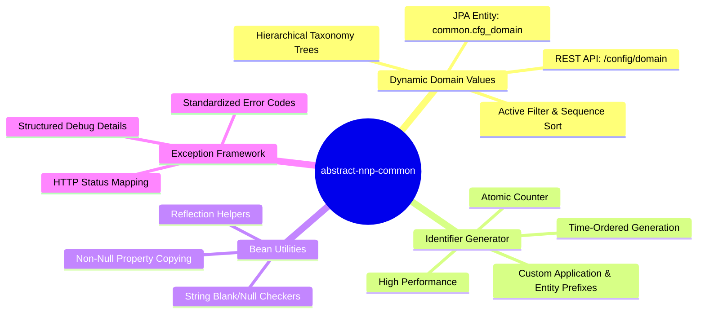

# PICC - PC - Abstract NNP Common (`abstract-nnp-common`)

[](LICENSE)
[](https://www.oracle.com/java/)
[](https://spring.io/projects/spring-boot)
[](#building-from-source)
[](CONTRIBUTING.md)

**abstract-nnp-common** is a reusable foundational library for Spring Boot microservices and enterprise applications within the **Platform Infrastructure and Core Components (PICC)** area of the **Nubo Native Platform (NNP)**.

It provides dynamic hierarchical domain-value management, standardized exception handling, reflection utilities, and high-performance entity identifier generation.

---

## Documentation Index

| Document | Description |
| :--- | :--- |
| **[User Manual & Deployment Guide](USER_MANUAL_AND_DEPLOYMENT_GUIDE.md)** | Comprehensive integration instructions, REST API specifications, database schema configuration, container deployment (Docker/Kubernetes), and operational troubleshooting. |
| **[Development Guidelines](DEVELOPMENT_GUIDELINES.md)** | Developer environment setup, architectural specifications, coding conventions, testing standards, and release management. |
| **[Contributing Guide](CONTRIBUTING.md)** | Contribution standards, pull request procedures, and governance. |
| **[Security Policy](SECURITY.md)** | Vulnerability reporting procedures and secret handling policies. |
| **[Maintainers](MAINTAINERS.md)** | Project maintainers and organizational stakeholders. |

---

## Core Capabilities



- **Dynamic Domain Values Service**: REST endpoint and JPA entity model (`ConfigDomain`) to manage and query hierarchical domain key-value pairs (e.g., countries, states, status codes, categories).
- **Identifier Generator**: High-performance, timestamp-assisted unique identifier generation with configurable application and entity prefixes (`UUIDGenerator`).
- **Bean & Property Utilities**: Reflection and property copying utilities (`NNPUtil`) to copy non-null properties between DTOs and entities.
- **Standardized Exception Framework**: Base runtime exception (`NNPException`) with standardized error enumeration (`NNPErrorCodes`).

---

## System Requirements

- **Java**: 17 (LTS) or 21 (LTS)
- **Spring Boot**: 3.2.x+ / Spring Framework 6.x+
- **Jakarta Persistence (JPA)**: 3.1+
- **Apache Maven**: 3.8+ (or compatible build tool)
- **Database**: PostgreSQL (recommended), MySQL, MariaDB, Oracle, or H2

---

## Installation

Add the dependency to your project's `pom.xml`:

```xml
<dependency>
    <groupId>com.nnp.common.abs</groupId>
    <artifactId>abstract-nnp-common</artifactId>
    <version>1.0.0</version>
</dependency>
```

---

## Quick Start

### 1. Enable Common Components in Spring Boot
Configure the consuming Spring Boot application main class to scan the library packages:

```java
package com.example.demo;

import org.springframework.boot.SpringApplication;
import org.springframework.boot.autoconfigure.SpringBootApplication;
import org.springframework.boot.autoconfigure.domain.EntityScan;
import org.springframework.data.jpa.repository.config.EnableJpaRepositories;
import org.springframework.context.annotation.ComponentScan;

@SpringBootApplication
@ComponentScan(basePackages = {"com.example.demo", "com.nnp.common.abs"})
@EntityScan(basePackages = {"com.example.demo", "com.nnp.common.abs.features.domainvalues.entity"})
@EnableJpaRepositories(basePackages = {"com.example.demo", "com.nnp.common.abs.features.domainvalues.repo"})
public class Application {
    public static void main(String[] args) {
        SpringApplication.run(Application.class, args);
    }
}
```

### 2. Generate Unique Entity Identifiers
```java
import com.nnp.common.abs.util.UUIDGenerator;

// (Optional) Configure application prefix at startup:
UUIDGenerator.setAppPrefix("PAY");

// Generate collision-resistant unique ID for an entity:
String orderId = UUIDGenerator.generateId("ORD");
// Result: PAY-ORD-1167772150
```

### 3. Copy Non-Null Properties Between Objects
```java
import com.nnp.common.abs.util.NNPUtil;

// Safely patch an entity from incoming DTO without overwriting with null values
NNPUtil.copyNonNullProperties(incomingDto, targetEntity, "id", "createdAt");
```

### 4. Query Dynamic Domain Values REST API
```http
GET /config/domain HTTP/1.1
Host: localhost:8080
Accept: application/json
```

**Response Format:**
```json
{
  "COUNTRY": {
    "US": {
      "label": "United States",
      "sequence": 1,
      "defaultKey": true,
      "children": {
        "STATE": {
          "CA": {
            "label": "California",
            "sequence": 1,
            "defaultKey": false
          }
        }
      }
    }
  },
  "STATUS": {
    "ACTIVE": {
      "label": "Active",
      "sequence": 1,
      "defaultKey": true
    }
  }
}
```

---

## Configuration Reference

Key properties configurable via `application.yml` or environment variables:

| Variable | Property | Default | Description |
| :--- | :--- | :--- | :--- |
| `SERVER_PORT` | `server.port` | `8080` | Application HTTP Port |
| `DB_HOST` | DataSource Host | `localhost` | Database Hostname or IP |
| `DB_PORT` | DataSource Port | `5432` | Database Port |
| `DB_NAME` | DataSource DB Name | `nnp_db` | Database Catalog Name |
| `DB_SCHEMA` | `hibernate.default_schema` | `common` | Database Schema Name |
| `DB_USERNAME` | DataSource Username | `postgres` | Database Username |
| `DB_PASSWORD` | DataSource Password | `postgres` | Database Password |
| `APP_PREFIX` | `UUIDGenerator` prefix | `NNP` | Default application ID prefix |

Reference configuration template: [`src/main/resources/application.yml.example`](src/main/resources/application.yml.example).

---

## Database Initialization

To use the **Domain Value Service**, execute the database scripts located in [`src/main/resources/dbscripts/`](src/main/resources/dbscripts/):

1. **Schema DDL**: Execute [`V1__DDL_config_domain.sql`](src/main/resources/dbscripts/V1__DDL_config_domain.sql) to create `common.cfg_domain`.
2. **Master Data DML**: Execute [`V2__DML_config_domain_sample_data.sql`](src/main/resources/dbscripts/V2__DML_config_domain_sample_data.sql) to seed domain records.

---

## Building from Source

```bash
# Compile and build package
mvn clean package

# Execute test suite
mvn test

# Install to local Maven repository
mvn clean install
```

---

## Maintainers and Support

Maintained by the **Nubo Native Platform (NNP)** team and community contributors. See [MAINTAINERS.md](MAINTAINERS.md) for details.

Inquiries and contributions: **contribution@nubons.com**

---

## License

This project is licensed under the [Apache License 2.0](LICENSE).