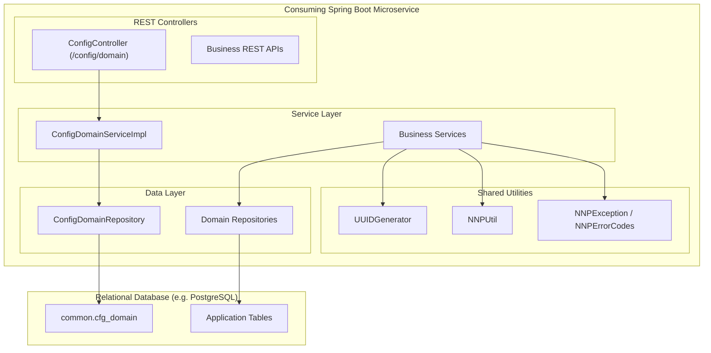

# abstract-nnp-common: User Manual & Deployment Guide

Welcome to the **abstract-nnp-common User Manual & Deployment Guide**. This document provides end-to-end guidance for application developers, architects, and DevOps/SRE teams integrating and deploying the `abstract-nnp-common` library within the Nubo Native Platform (NNP) and Spring Boot ecosystem.

---

## Table of Contents

1. [Overview & Architecture](#1-overview--architecture)
2. [Prerequisites & System Requirements](#2-prerequisites--system-requirements)
3. [Installation & Maven Integration](#3-installation--maven-integration)
4. [Database Setup & Schema Management](#4-database-setup--schema-management)
5. [Configuration & Environment Reference](#5-configuration--environment-reference)
6. [Feature User Guide](#6-feature-user-guide)
   - [6.1 Hierarchical Domain Configuration Service](#61-hierarchical-domain-configuration-service)
   - [6.2 Custom Unique Identifier Generator (`UUIDGenerator`)](#62-custom-unique-identifier-generator-uuidgenerator)
   - [6.3 Bean Property Copier & Utilities (`NNPUtil`)](#63-bean-property-copier--utilities-nnputil)
   - [6.4 Standardized Exception Handling (`NNPException` & `NNPErrorCodes`)](#64-standardized-exception-handling-nnpexception--nnperrorcodes)
7. [Spring Boot Application Integration](#7-spring-boot-application-integration)
8. [Deployment Strategies & Containerization](#8-deployment-strategies--containerization)
   - [8.1 Embedded Library Mode](#81-embedded-library-mode)
   - [8.2 Standalone Microservice Mode](#82-standalone-microservice-mode)
   - [8.3 Docker & Container Deployment](#83-docker--container-deployment)
   - [8.4 Kubernetes & Cloud-Native Deployment](#84-kubernetes--cloud-native-deployment)
9. [Production Readiness & Hardening](#9-production-readiness--hardening)
10. [Troubleshooting & Operational Runbook](#10-troubleshooting--operational-runbook)

---

## 1. Overview & Architecture

`abstract-nnp-common` is a core shared library of the **Platform Infrastructure and Core Components (PICC)** layer within the **Nubo Native Platform (NNP)**. It is designed to solve common cross-cutting challenges across microservices:



### Core Value Propositions:
- **Hierarchical Domain Configuration Service**: Standardized master data provider with parent-child taxonomy trees (e.g., Countries &rarr; States &rarr; Cities, System Status Codes, Categories).
- **Time-Ordered Identifier Generation**: Formatted, collision-resistant identifier generation without UUID hyphen overhead.
- **Null-Safe Bean Copying**: Reflection-based property copying to streamline DTO-to-Entity conversions.
- **Enterprise Error Normalization**: Consistent error code contracts across all microservice layers.

---

## 2. Prerequisites & System Requirements

| Component | Minimum Version | Recommended | Notes |
| :--- | :--- | :--- | :--- |
| **Java JDK** | 17 (LTS) | Java 17 or Java 21 (LTS) | Compiled with Java 17 target bytecode. |
| **Spring Boot** | 3.2.0+ | 3.2.5+ | Compatible with Spring Framework 6.1+. |
| **Jakarta Persistence (JPA)** | 3.1+ | Jakarta EE 10 JPA | Included via `spring-boot-starter-data-jpa`. |
| **Relational Database** | PostgreSQL 13+ | PostgreSQL 15+ or 16+ | Supports MySQL, MariaDB, Oracle, H2 with schema mapping. |
| **Build Tool** | Apache Maven 3.8.0+ | Maven 3.9+ | Gradle 7.5+ also supported. |

---

## 3. Installation & Maven Integration

### Maven Dependency
Add the dependency to your consuming Spring Boot service's `pom.xml`:

```xml
<dependency>
    <groupId>com.nnp.common.abs</groupId>
    <artifactId>abstract-nnp-common</artifactId>
    <version>1.0.0</version>
</dependency>
```

### Gradle Dependency
If using Gradle (`build.gradle`):

```groovy
implementation 'com.nnp.common.abs:abstract-nnp-common:1.0.0'
```

> [!NOTE]
> If building from source or private Nexus/Artifactory repository, ensure your `settings.xml` contains the appropriate server credentials for the `ossrh` or internal repository id.

---

## 4. Database Setup & Schema Management

If your application uses the **Domain Value Configuration Feature**, the `cfg_domain` table must be initialized in your database.

### 4.1 Schema Definition
The table is designed for PostgreSQL with schema `common`. The DDL script is located at:
`src/main/resources/dbscripts/V1__DDL_config_domain.sql`

```sql
CREATE SCHEMA IF NOT EXISTS common;

CREATE TABLE IF NOT EXISTS common.cfg_domain (
    id VARCHAR(64) NOT NULL,
    name VARCHAR(100) NOT NULL,
    value_key VARCHAR(100) NOT NULL,
    value_label VARCHAR(255),
    seq INTEGER DEFAULT 0,
    "default" BOOLEAN DEFAULT FALSE,
    active BOOLEAN DEFAULT TRUE,
    parent_id VARCHAR(64),
    created_at TIMESTAMP WITHOUT TIME ZONE DEFAULT CURRENT_TIMESTAMP,
    updated_at TIMESTAMP WITHOUT TIME ZONE DEFAULT CURRENT_TIMESTAMP,
    CONSTRAINT pk_cfg_domain PRIMARY KEY (id),
    CONSTRAINT fk_cfg_domain_parent FOREIGN KEY (parent_id) 
        REFERENCES common.cfg_domain (id) ON DELETE RESTRICT
);

-- Performance indexes
CREATE INDEX IF NOT EXISTS idx_cfg_domain_name_active ON common.cfg_domain (name, active);
CREATE INDEX IF NOT EXISTS idx_cfg_domain_parent_id ON common.cfg_domain (parent_id);
```

### 4.2 Seed Master Data (DML)
A sample dataset with hierarchical Country/State structures and Status lookups is provided in:
`src/main/resources/dbscripts/V2__DML_config_domain_sample_data.sql`

```sql
-- Root level domain: COUNTRY
INSERT INTO common.cfg_domain (id, name, value_key, value_label, seq, "default", active, parent_id)
VALUES 
('DOM-CNT-US', 'COUNTRY', 'US', 'United States', 1, TRUE, TRUE, NULL),
('DOM-CNT-IN', 'COUNTRY', 'IN', 'India', 2, FALSE, TRUE, NULL)
ON CONFLICT (id) DO NOTHING;

-- Hierarchical child domain: STATE (references parent_id DOM-CNT-US)
INSERT INTO common.cfg_domain (id, name, value_key, value_label, seq, "default", active, parent_id)
VALUES 
('DOM-ST-CA', 'STATE', 'CA', 'California', 1, FALSE, TRUE, 'DOM-CNT-US'),
('DOM-ST-NY', 'STATE', 'NY', 'New York', 2, FALSE, TRUE, 'DOM-CNT-US')
ON CONFLICT (id) DO NOTHING;
```

### 4.3 Database Migration Integration (Flyway / Liquibase)
- **Flyway**: Copy scripts to `src/main/resources/db/migration/` using standard version prefixes (`V1__...sql`, `V2__...sql`).
- **Liquibase**: Wrap the DDL and DML in SQL formatted changelog sets.

---

## 5. Configuration & Environment Reference

All components support 12-factor configuration through environment variables and Spring configuration properties.

### 5.1 Environment Variables

| Variable | Target Property | Default | Purpose / Description |
| :--- | :--- | :--- | :--- |
| `SERVER_PORT` | `server.port` | `8080` | HTTP listening port for REST controllers. |
| `SERVER_SERVLET_CONTEXT_PATH` | `server.servlet.context-path` | `/` | Web application root context path. |
| `DB_HOST` | DataSource Host | `localhost` | Relational database hostname or IP. |
| `DB_PORT` | DataSource Port | `5432` | Relational database port. |
| `DB_NAME` | DataSource DB Name | `nnp_db` | Target database catalog name. |
| `DB_SCHEMA` | `hibernate.default_schema` | `common` | Database schema name for entity tables. |
| `DB_USERNAME` | DataSource Username | `postgres` | Database authentication user. |
| `DB_PASSWORD` | DataSource Password | `postgres` | Database authentication password. |
| `DB_DRIVER_CLASS_NAME` | DataSource Driver | `org.postgresql.Driver` | JDBC driver class name. |
| `JPA_HIBERNATE_DDL_AUTO` | `spring.jpa.hibernate.ddl-auto` | `validate` | DDL validation strategy (`validate`, `none`, `update`). |
| `JPA_SHOW_SQL` | `spring.jpa.show-sql` | `false` | Enable SQL query log statements. |
| `APP_PREFIX` | `UUIDGenerator` prefix | `NNP` | Root application prefix for ID generation. |
| `LOGGING_LEVEL_APP` | `logging.level.com.nnp` | `DEBUG` | Application package logging level. |

### 5.2 Reference `application.yml`
Place this in your microservice's `src/main/resources/application.yml`:

```yaml
server:
  port: ${SERVER_PORT:8080}
  servlet:
    context-path: ${SERVER_SERVLET_CONTEXT_PATH:/}

spring:
  application:
    name: my-nnp-service
  datasource:
    url: jdbc:postgresql://${DB_HOST:localhost}:${DB_PORT:5432}/${DB_NAME:nnp_db}?currentSchema=${DB_SCHEMA:common}
    username: ${DB_USERNAME:postgres}
    password: ${DB_PASSWORD:postgres}
    driver-class-name: ${DB_DRIVER_CLASS_NAME:org.postgresql.Driver}
    hikari:
      maximum-pool-size: ${DB_POOL_MAX:10}
      minimum-idle: ${DB_POOL_MIN:2}
      idle-timeout: 30000
      connection-timeout: 20000
      pool-name: NnpHikariCP
  jpa:
    show-sql: ${JPA_SHOW_SQL:false}
    open-in-view: false
    hibernate:
      ddl-auto: ${JPA_HIBERNATE_DDL_AUTO:validate}
    properties:
      hibernate:
        format_sql: false
        default_schema: ${DB_SCHEMA:common}

logging:
  level:
    root: ${LOGGING_LEVEL_ROOT:INFO}
    com.nnp: ${LOGGING_LEVEL_APP:INFO}
```

---

## 6. Feature User Guide

### 6.1 Hierarchical Domain Configuration Service

The Domain Configuration service provides centralized, cacheable, hierarchical key-value taxonomy for application forms, drop-downs, and domain rules.

#### REST API Endpoint
- **Method**: `GET`
- **Path**: `/config/domain`
- **Produces**: `application/json`

#### Example HTTP Request
```http
GET /config/domain HTTP/1.1
Host: localhost:8080
Accept: application/json
```

#### Example JSON Response
```json
{
  "COUNTRY": {
    "IN": {
      "label": "India",
      "sequence": 2,
      "defaultKey": false,
      "children": {
        "STATE": {
          "KA": {
            "label": "Karnataka",
            "sequence": 2,
            "defaultKey": false
          },
          "MH": {
            "label": "Maharashtra",
            "sequence": 1,
            "defaultKey": false
          }
        }
      }
    },
    "US": {
      "label": "United States",
      "sequence": 1,
      "defaultKey": true,
      "children": {
        "STATE": {
          "CA": {
            "label": "California",
            "sequence": 1,
            "defaultKey": false
          },
          "NY": {
            "label": "New York",
            "sequence": 2,
            "defaultKey": false
          },
          "TX": {
            "label": "Texas",
            "sequence": 3,
            "defaultKey": false
          }
        }
      }
    }
  },
  "STATUS": {
    "ACTIVE": {
      "label": "Active",
      "sequence": 1,
      "defaultKey": true
    },
    "INACTIVE": {
      "label": "Inactive",
      "sequence": 2,
      "defaultKey": false
    },
    "PENDING": {
      "label": "Pending Approval",
      "sequence": 3,
      "defaultKey": false
    }
  }
}
```

#### Programmatic Java Service Access
You can inject `IConfigDomainService` directly into your business services:

```java
package com.mycompany.service;

import com.nnp.common.abs.features.domainvalues.service.IConfigDomainService;
import com.nnp.common.abs.features.domainvalues.vo.ConfigDomainSetVO;
import org.springframework.stereotype.Service;

@Service
public class ReferenceDataService {

    private final IConfigDomainService configDomainService;

    public ReferenceDataService(IConfigDomainService configDomainService) {
        this.configDomainService = configDomainService;
    }

    public ConfigDomainSetVO getAllMasterDomains() {
        return configDomainService.fetchDomains();
    }
}
```

---

### 6.2 Custom Unique Identifier Generator (`UUIDGenerator`)

The `UUIDGenerator` produces compact, human-readable, time-ordered entity identifiers without dashes or 36-character UUID overhead.

#### Format Specification
```
<APP_PREFIX>-<ENTITY_PREFIX>-<COUNTER><TIMESTAMP_LOW><TIMESTAMP_HIGH>
```
Example: `NNP-ORD-1167772150`

#### Usage Examples:
```java
import com.nnp.common.abs.util.UUIDGenerator;
import org.springframework.boot.CommandLineRunner;
import org.springframework.stereotype.Component;

@Component
public class AppStartupRunner implements CommandLineRunner {

    @Override
    public void run(String... args) {
        // 1. (Optional) Customize the Application Prefix at startup
        UUIDGenerator.setAppPrefix("PAY");

        // 2. Generate IDs for various domain entities
        String orderId = UUIDGenerator.generateId("ORD");   // PAY-ORD-115349120
        String invoiceId = UUIDGenerator.generateId("INV"); // PAY-INV-215349122
        String txnId = UUIDGenerator.generateId("TXN");     // PAY-TXN-315349124

        System.out.println("Generated Order ID: " + orderId);
    }
}
```

---

### 6.3 Bean Property Copier & Utilities (`NNPUtil`)

`NNPUtil` simplifies data-transfer-object mapping and entity patch updates by selectively copying only non-null properties.

#### Usage Examples:

```java
import com.nnp.common.abs.util.NNPUtil;

public class OrderService {

    public OrderEntity updateOrder(OrderUpdateRequest request, OrderEntity existingOrder) {
        // Validate input
        if (NNPUtil.isBlankOrNull(request.getCustomerName())) {
            // handle blank
        }

        // Copy all non-null fields from request into existingOrder, ignoring 'id' and 'createdAt'
        NNPUtil.copyNonNullProperties(request, existingOrder, "id", "createdAt");

        return orderRepository.save(existingOrder);
    }
}
```

---

### 6.4 Standardized Exception Handling (`NNPException` & `NNPErrorCodes`)

`NNPException` is an unchecked runtime exception with structured HTTP status error codes.

#### Available Error Codes (`NNPErrorCodes`):

| Code Enum | HTTP Status | Standard Message | Typical Use Case |
| :--- | :--- | :--- | :--- |
| `BAD_REQ_PARAM` | 400 | `Bad request parameter` | Missing or invalid request parameters. |
| `ITEM_NOT_FOUND` | 404 | `Item Not Found` | Requested entity ID does not exist. |
| `METHOD_NOT_ALLOWED` | 405 | `Mandatory components can not be removed from plan.` | Business action disallowed by policy. |
| `ITEM_NOT_ACCEPTABLE` | 406 | `Already present. Insert/Update not possible.` | Conflict, duplicate unique key. |
| `UN_PROCESSABLE_ENTITY` | 422 | `Unprocessable Entity.` | Validation logic failure or state violation. |
| `UNKNOWN_EXCEPTION` | 500 | `Unknown Internal Error` | Unexpected system failure. |
| `SERVICE_ERROR` | 500 | `External Service Error` | Downstream RPC or HTTP microservice outage. |

#### Usage Example:
```java
import com.nnp.common.abs.exception.NNPException;
import com.nnp.common.abs.exception.NNPErrorCodes;

public class CustomerService {

    public Customer findCustomer(String customerId) {
        return customerRepository.findById(customerId)
            .orElseThrow(() -> new NNPException(
                NNPErrorCodes.ITEM_NOT_FOUND, 
                "Customer not found for ID: " + customerId
            ));
    }
}
```

---

## 7. Spring Boot Application Integration

To activate the common library components, ensure your Spring Boot main application class scans the library packages:

```java
package com.mycompany.application;

import org.springframework.boot.SpringApplication;
import org.springframework.boot.autoconfigure.SpringBootApplication;
import org.springframework.boot.autoconfigure.domain.EntityScan;
import org.springframework.data.jpa.repository.config.EnableJpaRepositories;
import org.springframework.context.annotation.ComponentScan;

@SpringBootApplication
@ComponentScan(basePackages = {
    "com.mycompany.application",
    "com.nnp.common.abs"
})
@EntityScan(basePackages = {
    "com.mycompany.application",
    "com.nnp.common.abs.features.domainvalues.entity"
})
@EnableJpaRepositories(basePackages = {
    "com.mycompany.application",
    "com.nnp.common.abs.features.domainvalues.repo"
})
public class MyMicroserviceApplication {

    public static void main(String[] args) {
        SpringApplication.run(MyMicroserviceApplication.class, args);
    }
}
```

---

## 8. Deployment Strategies & Containerization

### 8.1 Embedded Library Mode
The most common deployment model: `abstract-nnp-common` is included as a regular Maven/Gradle JAR inside multiple independent Spring Boot microservices. Each service connects to its shared or dedicated database schema.

### 8.2 Standalone Microservice Mode
You can package a minimal Spring Boot runner around `abstract-nnp-common` to run it as a standalone Configuration Microservice exposing `/config/domain` across your organization.

### 8.3 Docker & Container Deployment

#### Multi-Stage Dockerfile (For Microservice Consuming abstract-nnp-common):
```dockerfile
# Stage 1: Build
FROM maven:3.9-eclipse-temurin-17-alpine AS builder
WORKDIR /workspace
COPY pom.xml .
COPY src ./src
RUN mvn clean package -DskipTests

# Stage 2: Runtime
FROM eclipse-temurin:17-jre-alpine
WORKDIR /app

# Run as non-root user for security
RUN addgroup -S appgroup && adduser -S appuser -G appgroup
USER appuser

COPY --from=builder /workspace/target/*.jar app.jar

ENV SERVER_PORT=8080 \
    DB_HOST=postgres \
    DB_PORT=5432 \
    DB_NAME=nnp_db \
    DB_SCHEMA=common \
    DB_USERNAME=postgres \
    DB_PASSWORD=postgres \
    APP_PREFIX=NNP

EXPOSE 8080
ENTRYPOINT ["java", "-jar", "app.jar"]
```

#### Docker Compose Example (`docker-compose.yml`):
```yaml
version: '3.8'

services:
  postgres:
    image: postgres:15-alpine
    container_name: nnp-postgres
    environment:
      POSTGRES_DB: nnp_db
      POSTGRES_USER: postgres
      POSTGRES_PASSWORD: secretpassword
    ports:
      - "5432:5432"
    volumes:
      - pgdata:/var/lib/postgresql/data
      - ./src/main/resources/dbscripts/V1__DDL_config_domain.sql:/docker-entrypoint-initdb.d/01_ddl.sql
      - ./src/main/resources/dbscripts/V2__DML_config_domain_sample_data.sql:/docker-entrypoint-initdb.d/02_dml.sql

  app:
    build: .
    container_name: nnp-service
    depends_on:
      - postgres
    environment:
      SERVER_PORT: 8080
      DB_HOST: postgres
      DB_PORT: 5432
      DB_NAME: nnp_db
      DB_SCHEMA: common
      DB_USERNAME: postgres
      DB_PASSWORD: secretpassword
    ports:
      - "8080:8080"

volumes:
  pgdata:
```

### 8.4 Kubernetes & Cloud-Native Deployment

Sample Kubernetes Deployment snippet:

```yaml
apiVersion: apps/v1
kind: Deployment
metadata:
  name: nnp-service
  labels:
    app: nnp-service
spec:
  replicas: 2
  selector:
    matchLabels:
      app: nnp-service
  template:
    metadata:
      labels:
        app: nnp-service
    spec:
      containers:
        - name: app
          image: myregistry.azurecr.io/nnp-service:1.0.0
          ports:
            - containerPort: 8080
          env:
            - name: SERVER_PORT
              value: "8080"
            - name: DB_HOST
              valueFrom:
                configMapKeyRef:
                  name: nnp-config
                  key: DB_HOST
            - name: DB_PASSWORD
              valueFrom:
                secretKeyRef:
                  name: nnp-db-secret
                  key: DB_PASSWORD
          readinessProbe:
            httpGet:
              path: /actuator/health/readiness
              port: 8080
            initialDelaySeconds: 15
            periodSeconds: 10
          livenessProbe:
            httpGet:
              path: /actuator/health/liveness
              port: 8080
            initialDelaySeconds: 30
            periodSeconds: 15
```

---

## 9. Production Readiness & Hardening

1. **Connection Pooling**: Always configure HikariCP pool parameters (`maximum-pool-size`, `minimum-idle`, `connection-timeout`) based on expected concurrent load.
2. **Schema Separation**: Use dedicated schemas (`common`) to isolate platform lookup data from transaction tables.
3. **Caching Configuration**: Domain configuration data changes infrequently. It is recommended to attach Spring Cache (`@Cacheable("domains")`) or a Redis layer over `IConfigDomainService.fetchDomains()` in high-throughput applications.
4. **Secret Management**: Never bake credentials into `application.yml` or container images. Supply passwords via Kubernetes Secrets, AWS Secrets Manager, or HashiCorp Vault.
5. **JVM Memory Tuning**: For containerized environments, use `-XX:+UseContainerSupport -XX:MaxRAMPercentage=75.0`.

---

## 10. Troubleshooting & Operational Runbook

| Symptom | Probable Cause | Recommended Resolution |
| :--- | :--- | :--- |
| `NoSuchBeanDefinitionException: No qualifying bean of type 'IConfigDomainService'` | `@ComponentScan` did not include `com.nnp.common.abs`. | Add `"com.nnp.common.abs"` to `@ComponentScan(basePackages = {...})`. |
| `Not a managed type: class com.nnp.common.abs.features.domainvalues.entity.ConfigDomain` | `@EntityScan` did not include the entity package. | Add `"com.nnp.common.abs.features.domainvalues.entity"` to `@EntityScan`. |
| `relation "common.cfg_domain" does not exist` | Database schema or table was not initialized. | Run `V1__DDL_config_domain.sql` against the database to create schema and table. |
| `org.hibernate.exception.SQLGrammarException: Table 'cfg_domain' doesn't exist` | Hibernate is querying the `public` schema instead of `common`. | Verify `spring.jpa.properties.hibernate.default_schema: common` or set schema in datasource connection string. |
| `NullPointerException` during `UUIDGenerator.generateId` | `UUIDGenerator` prefix not initialized. | The default is `"NNP"`. If overridden, ensure valid string is passed to `UUIDGenerator.setAppPrefix(...)`. |
